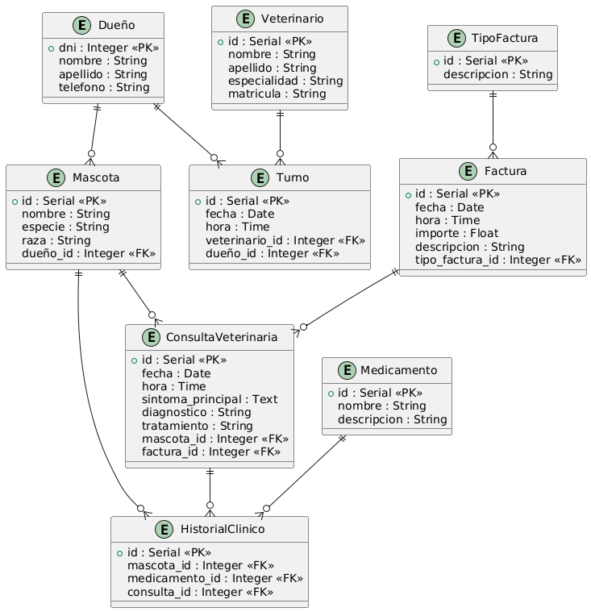

# Proyecto de Migración de Base de Datos de una Veterinaria de PostgreSQL a MongoDB

## Integrantes del GRUPO N°1

Nombre | Legajo |
--- | --- |
Felipe Diaz Bertero | 15326
Agustin Castillo | 15470
Elisa Nardi | 16136
Federico Villoria | 13906
Milagros Oliva | 14952
Nahuel Fruttero | 13424
Fernando Monti | 10289
Nazareno Fabiani | 14934

# Índice

1. **Resumen**
2. **Requisitos Previos**
3. **Procedimiento**
  - **Paso 1**. Importación del Proyecto
  - **Paso 2**. Ingreso a la Base de Datos
4. ***Estructura del Proyecto***
  - Estructura General de Todos los Archivos
  - Archivos clave para la Migracion
    - models.py
    - populate.py
    - migrator.py
    - signals.py
5. Flujo de ejecucion del Proyecto


# Resumen

En este tutorial vamos a ver cómo crear una base de datos utilizando __*PostgreSQL*__ utilizando el Framework de Python llamado **Django** con una Base de Datos para un sistema de una Clinica Veterinaria, para posteriormente, poder migrar la definicion de las tablas en SQL pero en formato **NoSQL** en el Sistema Gestor de Bases de Datos No Relacional **MongoDB**.

A lo largo del tutorial vamos a ir paso a paso: creando las tablas, configurando las relaciones, importando los datos desde el __*CSV*__ y verificando que todo haya salido bien.

Este trabajo es ideal si se empieza a practicar con bases de datos relacionales y se quiere trabajar con un caso real, con datos abiertos y relevantes.


# **Requisitos Previos**

Antes de comenzar, asegúrate de tener instalados los siguientes componentes:

- [Docker](https://www.docker.com/)
- [Docker Compose](https://docs.docker.com/compose/)
- [Python 3](https://www.python.org/downloads/)
- [Django](https://www.djangoproject.com)
- ***PyMongo***
- ***Psycopg2***
- Navegador web para acceder a los administradores de la base de datos PostgreSQL y MongoDB.


_Nota: Las ultimas dos dependencias se instalaran solas al ejecutar el proyecto, definidas en requirements.txt_


# Procedimiento


## Paso 1. Importación del proyecto

Se debe clonar el repositorio con todo el proyecto ingresando en la consola:

```
git clone https://github.com/FeliDB/Veterinaria_Migracion
```

Para cambiar al directorio raiz del proyecto:
```
cd Veterinaria_Migracion
```

### Estructura del proyecto

El proyecto, en el directorio raiz, contiene:


El archivo docker-compose.yml
```
services:
  postgres:
    image: postgres:14
    container_name: postgres_db
    environment:
      POSTGRES_DB: veterinaria
      POSTGRES_USER: usuario
      POSTGRES_PASSWORD: 12345
    ports:
      - "5432:5432"
    volumes:
      - postgres_data:/var/lib/postgresql/data

  mongo:
    image: mongo:6
    container_name: mongo_db
    ports:
      - "27017:27017"
    volumes:
      - mongo_data:/data/db

  backend:
    build: .
    container_name: django_backend
    command: python manage.py runserver 0.0.0.0:8000
    volumes:
      - ./backend:/app
    ports:
      - "8000:8000"
    depends_on:
      - postgres
      - mongo

  adminer:
    image: adminer
    ports:
      - 8080:8080

  mongo-express:
    image: mongo-express
    restart: always
    ports:
      - 8081:8081
    environment:
      ME_CONFIG_MONGODB_SERVER: mongo
      ME_CONFIG_BASICAUTH: "false"

volumes:
  postgres_data:
  mongo_data:

```

Este archivo contiene la definicion de los servicios que se crearán dentro del contenedor:

+ __PostgreSQL__ (para la base de datos en formato SQL)
+ __mongo__ (para la base de datos en formato NoSQL MongoDB)
+ __backend__ (el backend del proyecto que se estará ejecutando en el contenedor)
+ __adminer__ (administrador web de la base de datos PostgreSQL)
+ __mongo-express__ (administrador web de la base de datos MongoDB)


### Docker Compose: PostgreSQL + MongoDB + Backend de Django + Adminer + Mongo Express

Este entorno de desarrollo levanta una base de datos PostgreSQL, una base de datos MongoDB, el backend del proyecto de Django y los administradores Web de las bases de datos. Todo dentro del contenedor de Docker

### Servicios

### 🐘 PostgreSQL
- image: postgres:14
- container_name: postgres_db
- environment:
  - POSTGRES_DB: veterinaria
  - POSTGRES_USER: usuario
  - POSTGRES_PASSWORD: 12345
- ports:
  - "5432:5432"
- volumes:
  - postgres_data:/var/lib/postgresql/data

### 🍃 MongoDB
- image: mongo:6
- container_name: mongo_db
  - ports:
  - "27017:27017"
- volumes:
  - mongo_data:/data/db

### 🟩 Backend de Django
```
  backend:
    build: .
    container_name: django_backend
    command: python manage.py runserver 0.0.0.0:8000
    volumes:
      - ./backend:/app
    ports:
      - "8000:8000"
    depends_on:
      - postgres
      - mongo
```

### 💻 Adminer de PostgreSQL
```
  adminer:
    image: adminer
    ports:
      - 8080:8080
```

### 💻 Mongo-Express para Django
```
  mongo-express:
    image: mongo-express
    restart: always
    ports:
      - 8081:8081
    environment:
      ME_CONFIG_MONGODB_SERVER: mongo
      ME_CONFIG_BASICAUTH: "false"
```


# Paso 2. Ingreso a la base de datos

La razon por la que hemos optado por utilizar Mongo-Express y Adminer, es para evitar utilizar la linea de comandos para todas las consultas y analisis de datos. Dicho esto, vamos a proceder con el ingreso a la base de datos


Para ello, simplemente ejecutamos los siguientes comandos en ese orden en la terminal

```
docker-compose down --volumes --remove-orphans 
docker-compose build
docker-compose up -d
docker-compose exec backend python manage.py makemigrations
docker-compose exec backend python manage.py migrate
python mongo_migrator/migrator.py
```

Al desglosar estos comandos:


- Elimina los contenedores y volumenes en caso de que ya existan
- Levanta el contenedor (e instala las dependencias necesarias especificadas en requirements.txt que a su vez, Dockerfile tiene la configuracion para eso)
- Detectar cambios en la definicion de los modelos para crear archivo de migracion
- Realizar la migracion desde la base de datos PostgreSQL hacia MongoDB manteniendo los registros


Luego de ejecutar el archivo, el servidor ya estará corriendo. Para acceder a las bases de datos de __PostgreSQL__ y __MongoDB__, entramos a las siguientes direcciones web

+ http://localhost:8080 __Base de Datos PostgreSQL__
+ http://localhost:8081 __Base de Datos MongoDB__


# Estructura del Proyecto

## Estructura General de Todos Los Archivos
```
Veterinaria_Migracion/
├── backend/
│   ├── manage.py
│   ├── backend/
│   │   ├── __init__.py
│   │   ├── settings.py
│   │   ├── urls.py
│   │   ├── wsgi.py
│   │   └── asgi.py
│   ├── app/
│   │   ├── __init__.py
│   │   ├── admin.py
│   │   ├── apps.py
│   │   ├── models.py
│   │   ├── views.py
│   │   ├── urls.py
│   │   ├── populate.py
│   │   ├── signals.py
│   │   └── migrations/
│   │       └── __init__.py
├── mongo_migrator/
│   └── migrator.py
├── docker-compose.yml
├── Dockerfile
├── requirements.txt
```

## Archivos clave para la Migracion:

### models.py

En este archivo, están definidas las tablas en formato SQL (Relacional) del sistema modelado:

He aqui el Diagrama Entidad Relacion adjunto:


```
from django.db import models


class Dueño(models.Model):
    dni = models.IntegerField(primary_key=True)
    nombre = models.CharField(max_length=100)
    apellido = models.CharField(max_length=100)
    telefono = models.CharField(max_length=20)  # para poder poner +54, guiones, etc.

    def __str__(self):
        return f"{self.nombre} {self.apellido}"


class Mascota(models.Model):
    dueño = models.ForeignKey(Dueño, on_delete=models.CASCADE, related_name='mascotas')
    nombre = models.CharField(max_length=100)
    especie = models.CharField(max_length=50)
    raza = models.CharField(max_length=50)

    def __str__(self):
        return self.nombre


class Medicamento(models.Model):
    nombre = models.CharField(max_length=100)
    descripcion = models.CharField(max_length=100)

    def __str__(self):
        return self.nombre


class TipoFactura(models.Model):
    descripcion = models.CharField(max_length=100)

    def __str__(self):
        return self.descripcion


class Factura(models.Model):
    fecha = models.DateField()
    hora = models.TimeField()
    importe = models.FloatField()
    descripcion = models.CharField(max_length=100)
    tipo_factura = models.ForeignKey(TipoFactura, on_delete=models.CASCADE, related_name='facturas')

    def __str__(self):
        return f"Factura {self.id} - {self.descripcion}"


class ConsultaVeterinaria(models.Model):
    mascota = models.ForeignKey(Mascota, on_delete=models.CASCADE, related_name='consultas')
    fecha = models.DateField()
    hora = models.TimeField()
    sintoma_principal = models.TextField()
    diagnostico = models.CharField(max_length=100)
    tratamiento = models.CharField(max_length=100)
    factura = models.ForeignKey(Factura, on_delete=models.CASCADE, related_name='consultas')

    def __str__(self):
        return f"Consulta {self.id} - {self.fecha}"


class Veterinario(models.Model):
    nombre = models.CharField(max_length=100)
    apellido = models.CharField(max_length=100)
    especialidad = models.CharField(max_length=100)
    matricula = models.CharField(max_length=100)

    def __str__(self):
        return f"{self.nombre} {self.apellido}"


class Turno(models.Model):
    fecha = models.DateField()
    hora = models.TimeField()
    veterinario = models.ForeignKey(Veterinario, on_delete=models.CASCADE, related_name='turnos')
    dueño = models.ForeignKey(Dueño, on_delete=models.CASCADE, related_name='turnos')

    def __str__(self):
        return f"Turno {self.id} - {self.fecha} {self.hora}"


class HistorialClinico(models.Model):
    mascota = models.ForeignKey(Mascota, on_delete=models.CASCADE, related_name='historial_clinico')
    medicamento = models.ForeignKey(Medicamento, on_delete=models.CASCADE, related_name='historiales')
    consulta = models.ForeignKey(ConsultaVeterinaria, on_delete=models.CASCADE, related_name='historiales')

    def __str__(self):
        return f"Historial {self.id} - Mascota {self.mascota.nombre}"
```

### populate.py

Este script contiene los registros o "filas" (hablando en terminos de SQL), de las diferentes tablas. Se ha creado con el proposito de que Django pueda migrar la base de datos al contener esta registros, ya que si no existe ningun registro, Django no migrara nada.


```
import os
import django
import random
from datetime import datetime, timedelta

# Configuración para ejecutar el script manual fuera de manage.py
os.environ.setdefault('DJANGO_SETTINGS_MODULE', 'backend.settings')
django.setup()

from app.models import (
    Dueño, Mascota, Medicamento, TipoFactura, Factura,
    ConsultaVeterinaria, Veterinario, Turno, HistorialClinico
)

def run():
    print("Cargando datos de prueba...")

    # Dueños
    d1 = Dueño.objects.create(dni=123, nombre="Carlos", apellido="Pérez", telefono="+54-911123456")
    d2 = Dueño.objects.create(dni=456, nombre="Laura", apellido="Gómez", telefono="+54-911654321")

    # Mascotas
    m1 = Mascota.objects.create(dueño=d1, nombre="Fido", especie="Perro", raza="Labrador")
    m2 = Mascota.objects.create(dueño=d2, nombre="Mishi", especie="Gato", raza="Persa")

    # Medicamentos
    med1 = Medicamento.objects.create(nombre="Antibiótico X", descripcion="Para infecciones")
    med2 = Medicamento.objects.create(nombre="Vacuna Y", descripcion="Inmunización")

    # Tipo Factura
    tf1 = TipoFactura.objects.create(descripcion="Factura A")
    tf2 = TipoFactura.objects.create(descripcion="Factura B")

    # Facturas
    f1 = Factura.objects.create(
        fecha=datetime.today().date(),
        hora=datetime.now().time(),
        importe=1500.0,
        descripcion="Consulta general",
        tipo_factura=tf1
    )

    f2 = Factura.objects.create(
        fecha=datetime.today().date(),
        hora=datetime.now().time(),
        importe=3000.0,
        descripcion="Consulta + vacuna",
        tipo_factura=tf2
    )

    # Consultas
    c1 = ConsultaVeterinaria.objects.create(
        mascota=m1,
        fecha=datetime.today().date(),
        hora=datetime.now().time(),
        sintoma_principal="Fiebre",
        diagnostico="Infección leve",
        tratamiento="Antibiótico",
        factura=f1
    )

    c2 = ConsultaVeterinaria.objects.create(
        mascota=m2,
        fecha=datetime.today().date(),
        hora=datetime.now().time(),
        sintoma_principal="Alergia",
        diagnostico="Dermatitis",
        tratamiento="Antialérgico",
        factura=f2
    )

    # Veterinarios
    vet1 = Veterinario.objects.create(nombre="Andrés", apellido="Ramírez", especialidad="Dermatología", matricula="VET1234")
    vet2 = Veterinario.objects.create(nombre="María", apellido="Fernández", especialidad="Clínica General", matricula="VET5678")

    # Turnos
    Turno.objects.create(fecha=datetime.today().date(), hora=datetime.now().time(), veterinario=vet1, dueño=d1)
    Turno.objects.create(fecha=datetime.today().date(), hora=datetime.now().time(), veterinario=vet2, dueño=d2)

    # Historiales clínicos
    HistorialClinico.objects.create(mascota=m1, medicamento=med1, consulta=c1)
    HistorialClinico.objects.create(mascota=m2, medicamento=med2, consulta=c2)

    print("✔ Datos cargados correctamente.")

if __name__ == '__main__':
    run()

```


### migrator.py

En este script, se encuentra la definicion de todo aquello que se tiene que migrar a la base de Datos MongoDB, por lo tanto, incluye a todas las tablas definidas anteriormente con sus respectivos atributos:

```
import psycopg2
from pymongo import MongoClient

# Conexión a PostgreSQL
pg_conn = psycopg2.connect(
    host="localhost",
    database="veterinaria",
    user="usuario",
    password="12345",
    port=5432
)
pg_cursor = pg_conn.cursor()

# Conexión a MongoDB
mongo_client = MongoClient("mongodb://localhost:27017/")
mongo_db = mongo_client["veterinaria_mongo"]

def migrate_dueño():
    pg_cursor.execute("SELECT dni, nombre, apellido, telefono FROM app_dueño")
    for dni, nombre, apellido, telefono in pg_cursor.fetchall():
        mongo_db.dueño.update_one(
            {"dni": dni},
            {"$set": {
                "nombre": nombre,
                "apellido": apellido,
                "telefono": telefono
            }},
            upsert=True
        )

def migrate_mascota():
    pg_cursor.execute("SELECT id, dueño_id, nombre, especie, raza FROM app_mascota")
    for id_, dueño_id, nombre, especie, raza in pg_cursor.fetchall():
        mongo_db.mascota.update_one(
            {"_id": id_},
            {"$set": {
                "dueño": dueño_id,
                "nombre": nombre,
                "especie": especie,
                "raza": raza
            }},
            upsert=True
        )

def migrate_medicamento():
    pg_cursor.execute("SELECT id, nombre, descripcion FROM app_medicamento")
    for id_, nombre, descripcion in pg_cursor.fetchall():
        mongo_db.medicamento.update_one(
            {"_id": id_},
            {"$set": {
                "nombre": nombre,
                "descripcion": descripcion
            }},
            upsert=True
        )

def migrate_tipo_factura():
    pg_cursor.execute("SELECT id, descripcion FROM app_tipofactura")
    for id_, descripcion in pg_cursor.fetchall():
        mongo_db.tipo_factura.update_one(
            {"_id": id_},
            {"$set": {
                "descripcion": descripcion
            }},
            upsert=True
        )

def migrate_factura():
    pg_cursor.execute("SELECT id, fecha, hora, importe, descripcion, tipo_factura_id FROM app_factura")
    for id_, fecha, hora, importe, descripcion, tipo_factura_id in pg_cursor.fetchall():
        mongo_db.factura.update_one(
            {"_id": id_},
            {"$set": {
                "fecha": fecha.isoformat(),
                "hora": str(hora),
                "importe": importe,
                "descripcion": descripcion,
                "tipo_factura": tipo_factura_id
            }},
            upsert=True
        )

def migrate_consulta_veterinaria():
    pg_cursor.execute("""SELECT id, mascota_id, fecha, hora, sintoma_principal, diagnostico, tratamiento, factura_id
                         FROM app_consultaveterinaria""")
    for id_, mascota_id, fecha, hora, sintoma_principal, diagnostico, tratamiento, factura_id in pg_cursor.fetchall():
        mongo_db.consulta_veterinaria.update_one(
            {"_id": id_},
            {"$set": {
                "mascota": mascota_id,
                "fecha": fecha.isoformat(),
                "hora": str(hora),
                "sintoma_principal": sintoma_principal,
                "diagnostico": diagnostico,
                "tratamiento": tratamiento,
                "factura": factura_id
            }},
            upsert=True
        )

def migrate_veterinario():
    pg_cursor.execute("SELECT id, nombre, apellido, especialidad, matricula FROM app_veterinario")
    for id_, nombre, apellido, especialidad, matricula in pg_cursor.fetchall():
        mongo_db.veterinario.update_one(
            {"_id": id_},
            {"$set": {
                "nombre": nombre,
                "apellido": apellido,
                "especialidad": especialidad,
                "matricula": matricula
            }},
            upsert=True
        )

def migrate_turno():
    pg_cursor.execute("SELECT id, fecha, hora, veterinario_id, dueño_id FROM app_turno")
    for id_, fecha, hora, veterinario_id, dueño_id in pg_cursor.fetchall():
        mongo_db.turno.update_one(
            {"_id": id_},
            {"$set": {
                "fecha": fecha.isoformat(),
                "hora": str(hora),
                "veterinario": veterinario_id,
                "dueño": dueño_id
            }},
            upsert=True
        )

def migrate_historial_clinico():
    pg_cursor.execute("SELECT id, mascota_id, medicamento_id, consulta_id FROM app_historialclinico")
    for id_, mascota_id, medicamento_id, consulta_id in pg_cursor.fetchall():
        mongo_db.historial_clinico.update_one(
            {"_id": id_},
            {"$set": {
                "mascota": mascota_id,
                "medicamento": medicamento_id,
                "consulta": consulta_id
            }},
            upsert=True
        )

if __name__ == "__main__":
    migrate_dueño()
    migrate_mascota()
    migrate_medicamento()
    migrate_tipo_factura()
    migrate_factura()
    migrate_consulta_veterinaria()
    migrate_veterinario()
    migrate_turno()
    migrate_historial_clinico()
    print("Migración a MongoDB completada.")
```

### signals.py

Este script de Python se ejecuta automaticamente al levantar el contenedor y comenzar la migracion. Simplemente inserta todo lo que esta en **populate.py** a la base de Datos.

```
from django.db.models.signals import post_migrate
from django.dispatch import receiver
from django.apps import apps
from app.models import Dueño
from django.db.utils import OperationalError


@receiver(post_migrate)
def populate_data(sender, **kwargs):
    if sender.name != "app":
        return

    try:
        if Dueño.objects.exists():
            return  # Ya hay datos

        from app.populate import run
        print("⚙️ Insertando datos de prueba...")
        run()
        print("✅ Datos insertados correctamente.")
    except OperationalError as e:
        print(f"⚠️ Error de base de datos: {e}")
```


# Flujo de ejecucion de proyecto

Al ejecutarse ```arrancar_proyecto.sh```, el flujo de ejecución será el siguiente

1. Crea un nuevo contenedor con los servicios descriptos anteriormente (o lo borra si ya existe)
2. Se ejecuta levanta y ejecuta el proyecto de Django cuyo servicio asociado se llama ***backend*** el cual es guardado dentro del contenedor
3. Se definen las tablas SQL definidas en ***models.py***, y se guardan dentro de la base de datos PostgreSQL, permitiendo despues poder visualizarse con el ***Adminer de PostgreSQL***
4. Una vez definidas, se ejecuta automaticamente el script ***migrator.py*** que se encarga de migrar esa base de datos definida en models.py a la base de datos MongoDB alojada dentro del contenedor de Docker, para poder ser visualizada con Mongo-Express.